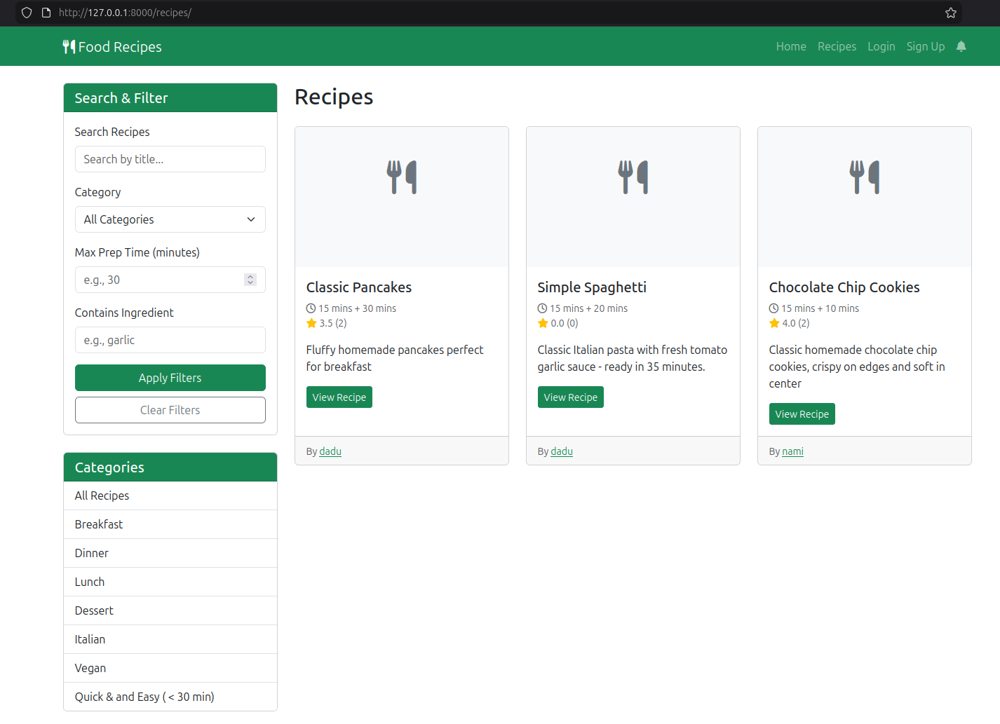

# 🍽️ Food Recipes Platform

A full-featured recipe sharing platform built with Django. Users can create, share, and discover recipes, with social features like likes, comments, bookmarks, and ratings.


## ✨ Features

### 👤 User System
- Custom user model with email authentication
- Registration, login, logout
- Profile pages with bio, picture, and website
- User dashboard for managing content

### 📝 Recipe Management
- Create recipes with title, description, category
- Dynamic ingredients (add multiple, specify quantity/unit)
- Dynamic step-by-step instructions
- Multiple image upload with featured image selection
- Edit and delete your own recipes

### 🔍 Discovery
- Browse all recipes with pagination
- Filter by category, preparation time, ingredients
- Search by recipe title
- View recipe details with full instructions

### ❤️ Social Features
- Like recipes
- Bookmark/save recipes for later
- Rate recipes (1-5 stars)
- Comment on recipes
- Activity feed showing user interactions

### 🔔 Notifications
- Get notified when someone likes or comments on your recipe
- Unread count badge in navbar
- Mark notifications as read

### 👤 User Profiles
- Public profile pages showing user's recipes and activity
- Stats: recipe count, total likes received
- Member since date
- Recent activity feed

### 🛠️ Admin Interface
- Full CRUD for all models
- Inline formsets for ingredients and steps
- User management with profile fields

## 🏗️ Tech Stack

- **Backend**: Django 4.2.28
- **Database**: SQLite (development) / PostgreSQL (production ready)
- **Frontend**: HTML5, CSS3, Bootstrap 5
- **Authentication**: django-allauth
- **Icons**: Font Awesome 6
- **Version Control**: Git & GitHub

## 📁 Project Structure

```
food_recipes_project/
├── apps/ # Django applications
│ ├── accounts/ # User authentication & profiles
│ ├── recipes/ # Recipe CRUD and interactions
│ ├── core/ # Homepage and shared views
│ └── notifications/ # Activity feed & notifications
├── config/ # Project settings
├── templates/ # HTML templates
│ ├── base.html
│ ├── accounts/ # Profile templates
│ └── recipes/ # Recipe templates
├── static/ # CSS, JS, images
├── media/ # User uploaded files
├── manage.py
└── requirements.txt
```

## 🚀 Installation

### Prerequisites
- Python 3.10+
- pip
- virtualenv (recommended)

### Setup Instructions

## bash
### 1. Clone the repository
git clone https://github.com/sele21/food-recipes.git
cd food-recipes

### 2. Create and activate virtual environment
python -m venv venv
source venv/bin/activate  # On Windows: venv\Scripts\activate

### 3. Install dependencies
pip install -r requirements.txt

### 4. Apply migrations
python manage.py migrate

### 5. Create superuser
python manage.py createsuperuser

### 6. Run development server
python manage.py runserver

# 📸 Screenshots



# 🧪 Testing

python manage.py test

# 📊 Database Schema

## User (CustomUser)
```
├── Profile (bio, picture, website)
├── Recipes (created by user)
├── Likes (recipes user liked)
├── Bookmarks (recipes user saved)
├── Ratings (user's ratings)
└── Comments (user's comments)
```

## Recipe
```
├── Category
├── Ingredients (dynamic)
├── Steps (ordered)
├── Images (multiple)
├── Likes
├── Bookmarks
├── Ratings
└── Comments
```
## Activity
```
├── Actor (user)
├── Verb (like, comment, create)
└── Target (recipe, comment)
```

# 🎯 Future Features

    User follows

    Recipe collections

    Shopping list generator

    Meal planner

    Recipe sharing via email

    PDF recipe download

    Advanced search with filters

    Recipe recommendations


# 🤝 Contributing

Contributions are welcome! Please feel free to submit a Pull Request.

    Fork the repository

    Create your feature branch (git checkout -b feature/AmazingFeature)

    Commit your changes (git commit -m 'Add some AmazingFeature')

    Push to the branch (git push origin feature/AmazingFeature)

    Open a Pull Request

# 📝 License

This project is licensed under the MIT License - see the LICENSE file for details.

# 👨‍💻 Author

*Solomon K. Tegegne*

    GitHub: @sele21

    Email: sele.edu21@gmail.com

# 🙏 Acknowledgments

    Django documentation

    Bootstrap 5

    Font Awesome

    All contributors and testers


**⭐ Star this repo if you find it helpful! Happy cooking! 🍳**
